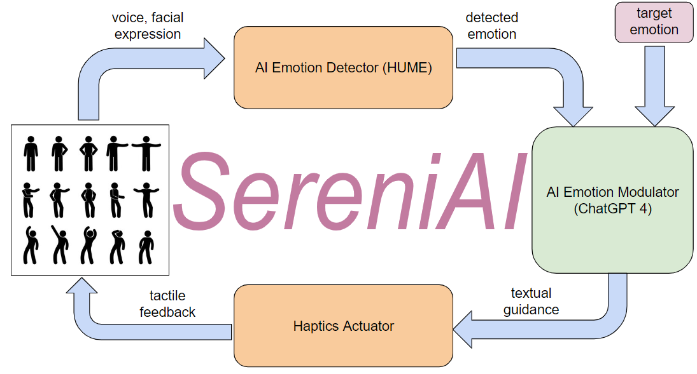

# SenreniAI: Your AI-Powered Emotional Companion

## Overview

In today's fast-paced world, managing stress from work or school has become increasingly challenging. Mental health and emotional well-being are more important than ever, yet finding effective ways to regulate our moods can be difficult. Enter SereniAI, an innovative product designed to support your emotional health with the power of AI and haptic technology.

### Why SereniAI?
SereniAI is like a supportive friend, always there to help you modulate your emotions. Leveraging advanced AI and customized haptics, SereniAI represents the cutting edge of "human-in-the-loop" emotional control.

### Key Features:
- **AI Emotion Detector**: Powered by HUME [1], this module accurately identifies your emotional state.
- **AI Emotion Modulator**: Utilizing the capabilities of ChatGPT-4 [2], this module helps guide and adjust your emotions.
- **Customized Haptics Device**: Built with Raspberry Pi and advanced actuators, this device delivers personalized haptic feedback to enhance emotional modulation.

With SereniAI, you can take control of your emotional well-being in a modern, effective way. Experience the future of emotional support with our AI-powered, haptics-enhanced solution.
## Innovative Features
1. **Human-in-the-loop Interaction**\
SereniAI connects directly with users, creating a stronger interaction between AI and humans. This allows users to feel and sense the impact of AI, rather than just interacting through text prompts. 

2. **Integration of AI and Haptic Devices**\
Haptic technology provides realistic tactile feedback, enhancing user experience. Unlike the typical graphical or textual formats of AI output, haptics technology bridges the gap between AI's output and the human user, enabling closer, more immersive interactions.
3. **Harnessing the Power of AI**\
Leveraging the extensive training data of large language models (LLMs), SereniAI acts as an emotional companion. It generates appropriate textual instructions to guide users toward their desired emotional state. These text commands are then translated into haptic feedback, facilitating a seamless human-machine interaction.
4. **Contributing to a Comprehensive Dataset**\
SereniAI uses a feedback loop to continuously improve its effectiveness. For each target emotional state ($s_t$) and the user's current emotional state ($s_i$), SereniAI provides a control signal ($c_i$) via the haptic device. We aim to build a dataset that records each emotional state ($s_i$ and $s_t$) and the corresponding haptic control ($c_i$). Users can provide feedback on the quality and effectiveness of the haptic input they receive. Over time, this dataset will be used to train models that produce effective haptic "treatments" for achieving specific emotional transitions. As the dataset grows, the accuracy and effectiveness of haptic controls will continue to improve.

## Future Work
- **Hosting and Training Dataset**

- **Integrate Facial Expression and Audio**

- **Investigating Different Haptics and LLM Modules**
### Reference
[1]: HUME AI, https://dev.hume.ai/intro \
[2]: OpenAI, ChatGPT-4, https://openai.com/index/gpt-4/